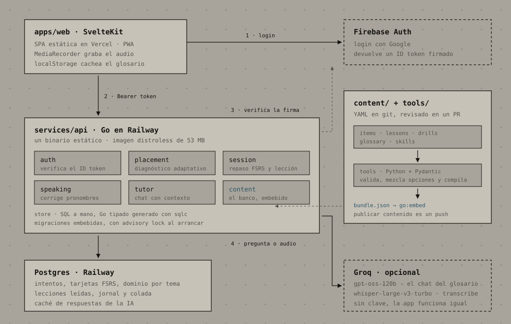

# Lost in Translation — caso de estudio

> Material en crudo para el portfolio: de acá salen el post y el carrusel, igual
> que `gridwright.md` en su momento. Todo lo que dice este archivo está en el
> repo y se puede verificar; los números salen de correr el proyecto, no de la
> memoria.

**Una línea:** una app que me enseña inglés y que, antes de enseñarme nada, mide
qué sé de verdad.

---

## 1. El problema

Aprendí inglés mirando series y trabajando. Leo un PR, sigo una call, me
defiendo. Pero mi gramática es intuición: elijo bien el tiempo verbal y no sé
explicar por qué. Ese techo no se mueve mirando más series, y un curso genérico
arranca en "the cat is on the table".

Tres cosas que ningún curso me daba:

- **Medir antes de enseñar.** No quiero repasar lo que ya sé.
- **El porqué, no solo la corrección.** Saber que está mal no me sirve si no sé
  qué regla me falló.
- **Contexto real.** Mi inglés se usa en dailies, PRs, incidentes y llamadas con
  clientes, no en un aeropuerto.

---

## 2. La decisión que sostiene todo

**La app sabe la respuesta antes de que yo abra la boca.**

Suena obvio hasta que se mira la práctica oral. Whisper, el modelo que transcribe,
**te corrige la gramática mientras transcribe**: si digo *he* hablando de Sofía,
muchas veces escribe *she*, porque prefiere lo que suena bien. Si confiara en la
transcripción para detectar errores, el error desaparecería justo antes de que yo
lo vea.

La salida fue invertir el orden: cada ejercicio oral declara de antemano qué
pronombres corresponden y cuáles delatan el error.

```yaml
- id: drill-diego-standup
  kind: pronouns
  seconds: 25
  context: Standup. Diego finished the migration last night and is on call today.
  prompt_en: Tell the team what Diego did last night and what he is doing today.
  expect: [he]
  avoid: [she]
```

El modelo hace lo único que solo él puede hacer —convertir sonido en texto— y el
veredicto lo da una comparación que se lee en cinco líneas de código. Es la misma
regla que uso en el resto del sistema: **si se puede chequear con un assert, no
lo decide un modelo.**

| Lo hace el código | Lo hace el modelo |
|---|---|
| Corregir la respuesta contra el banco | Transcribir lo que dije |
| Saber qué pronombre esperaba el ejercicio | Contestar lo que el glosario no cubre |
| Programar el próximo repaso (FSRS) | — |
| Mover el dominio, la racha y los puntos | — |
| Elegir el próximo tema y el próximo ejercicio | — |

---

## 3. El contenido es código

El banco de ejercicios no vive en una base: son archivos YAML en git, revisados
en un PR, que una herramienta en Python valida y compila a un JSON que el binario
de Go **embebe**. Publicar contenido es un push.

Eso permite que el contenido tenga tests, y ahí apareció lo más interesante del
proyecto.

### La app hacía trampa y me la hizo notar el usuario

Después de hacer el diagnóstico completo, escribí esto:

> "en las opciones que afirman algo, siempre la opción más larga es la correcta,
> es muy identificable"

Lo medí sobre el banco entero. Tenía razón, y había algo peor:

| Filtración | Antes | Después |
|---|---|---|
| La correcta era la más larga | **94%** de los ítems, casi el doble de largo | mediana de 3 caracteres de diferencia |
| La correcta estaba primera | **82%** | repartida entre las cuatro posiciones |

Con eso, se podía aprobar sin saber inglés. Y lo que más me gustó del arreglo es
que no fue "reescribir los ítems": fue **convertir la observación en una regla
que el build hace cumplir**.

- Las opciones se mezclan al compilar, con una semilla fija por ítem.
- La opción correcta no puede sacarle más de diez caracteres a la más larga de
  las otras.
- La correcta no puede quedar primera más seguido de lo que dicta el azar, que
  con dos opciones es 50% y con cuatro es 25%.
- Una explicación no puede citar posiciones ("la primera es la correcta"), porque
  el mezclado la dejaría mintiendo.

Los 26 ítems que violaban la regla se reescribieron. Desde entonces, ningún ítem
nuevo puede volver a colarse.

### Otras dos reglas que salieron de usar la app

- **Una lección necesita al menos ocho ejercicios de práctica**, o es algo que se
  lee, se entiende y se olvida.
- **Todo verbo regular lleva cómo suena su -ed**, y el validador lo verifica en
  los casos que no admiten discusión: termina en t o d → /ɪd/ (*contracted* =
  con-trac-tid), termina en sonido sordo → /t/ (*pushed* = pusht).

---

## 4. Tres errores que encontraron los tests, no yo

**El diagnóstico se gastaba a sí mismo.** Cada respuesta del test de ubicación
creaba una tarjeta de repaso, así que esas mismas preguntas iban a volver en la
sesión diaria. La próxima medición habría medido memoria, no nivel. Hoy los ítems
de ubicación están reservados para medir y la práctica usa otros.

**La sesión saltaba de tema.** Al responder un ejercicio, la app cambiaba al tema
siguiente: un tema recién practicado quedaba con dominio 0.2 y perdía contra los
que nunca se habían tocado, que figuraban en 0. Lo encontró un test de punta a
punta, no yo mirando la pantalla. Ahora un tema empezado se termina.

**El chat inventaba la pronunciación.** Le pregunté cómo suena el pasado de
*want* y contestó que, como termina en /t/, la -ed suena /t/. Es exactamente al
revés. La solución no fue pedirle que se esfuerce más: fue **pasarle el dato**.
El servidor arma la pregunta con el ejercicio que tengo en pantalla y con las
entradas del glosario que menciona la pregunta, incluido el sonido real del
verbo. Con el dato adelante, dejó de improvisar.

---

## 5. Cómo está hecho

```
apps/web/        SvelteKit (SPA estática)  → Vercel
services/api/    Go + Postgres             → Railway
content/         el banco, en YAML
tools/           Python: valida y compila el bundle
```



Decisiones que puedo defender:

- **Go** para la API: un binario estático, imagen distroless de 53 MB, arranque
  en milisegundos y casi sin dependencias. El manejo de errores y el SQL están a
  la vista.
- **sqlc en vez de un ORM**: escribo SQL real y me genera Go tipado. Una query
  que no coincide con el esquema falla al generar, no en producción.
- **SvelteKit** y SPA: el login es con Firebase en el navegador y los datos vienen
  de la API, así que renderizar en servidor no sumaba nada. La web son archivos
  estáticos.
- **Firebase solo para identidad**: el login con Google y la renovación de tokens
  son problema de otro. La API verifica la firma contra las claves públicas de
  Google; los datos viven en mi Postgres.
- **Repaso espaciado con FSRS**, el mismo algoritmo moderno que usa Anki, con el
  estado por ítem en la base.

Una transacción vale por toda la explicación de consistencia: responder un
ejercicio bloquea la corrida con `SELECT … FOR UPDATE`, así que si toco dos veces
el segundo pedido espera, ve que ese ítem ya se respondió y recibe un 409. El
intento, la tarjeta de repaso y el dominio se guardan juntos o no se guarda nada.

---

## 6. La metáfora, que no es decoración

El progreso no es una barra: es una obra de hormigón que se construye. Cada tema
es una pieza, y las piezas vecinas comparten una junta única, así que solo esas
dos calzan entre sí.

- Un tema que no domino **levita** con la junta abierta.
- Cuando lo domino, **baja y calza**.
- Si lo abandono, **chorrea óxido**.

La geometría es la misma que usé en el carrusel de Gridwright, adaptada: allá el
alto de cada pieza era el de una sección de la página, acá es cuánta práctica
tiene el tema. El sistema visual sale de mi manual de marca —hormigón, tinta, una
sola baranda de color, la retícula de tensores a la vista— y la tipografía se
decidió de nuevo, porque lo que sirve para una slide no sirve para leer todos los
días.

Hay un test que lee los colores reales del CSS y **falla el build si un texto
baja del contraste mínimo**. La accesibilidad como assert, no como buena
intención.

---

## 7. Los números

| | |
|---|---|
| Banco | 250 ejercicios, 13 lecciones, 7 drills orales |
| Glosario | 120 verbos irregulares, 76 regulares con su sonido, 82 términos, 8 reglas, 7 chuletas |
| Mapa | 34 temas, de presente simple a condicionales y estilo indirecto |
| Tests | 364 en Go, 43 en la web, 20 de contenido, 8 de punta a punta en dos dispositivos |
| CI | cuatro trabajos en cada push; Railway y Vercel despliegan desde `main` |
| Imagen | 53 MB, distroless, sin shell |

Mi diagnóstico real, que es el que ordena el currículum: **15 de 34 temas
dominados**. Lo más flojo, "inglés de trabajo": 2 de 8, con los dos condicionales
en cero. Justo lo que más necesito para hablar con clientes.

---

## 8. Lo que me llevo

- **Medir es más difícil que enseñar.** Escribir 250 ejercicios es trabajo;
  lograr que midan lo que dicen medir es diseño. Las dos filtraciones más grandes
  del proyecto no eran bugs de código: eran ejercicios que se podían acertar sin
  saber inglés.
- **Cuando escribe un modelo, hay que medir el sesgo, no solo validar el
  formato.** Largo de opción y posición de la respuesta son dos métricas que
  ahora corro sobre cualquier banco generado.
- **Poner la IA donde no hay alternativa, y no más allá.** Transcribir audio, sí.
  Decidir si estuvo bien, no.
- **El usuario encuentra lo que los tests no buscan.** La filtración del largo la
  vi cuando alguien usó la app de verdad. Los tests atrapan lo que ya sabés que
  puede romperse.

## 9. Lo que falta

21 de los 34 temas todavía no tienen lección. La escritura y los exámenes de hito
no están. La pronunciación se corrige por lo que muestra la transcripción, sin
puntaje de fonemas. Y los tipos están escritos dos veces, en Go y en TypeScript:
si cambian de un lado, se rompe en ejecución y no al compilar.

Nada de eso lo descubrí escribiendo este archivo: está en el PLAN, con fecha, y
la app se usa igual todos los días.
